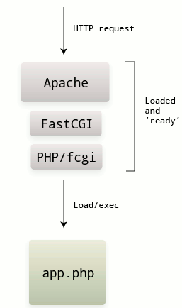
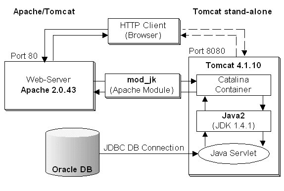

# 


#
\centering
\begin{Huge}
What is Erlang,

and how does it work?
\end{Huge}

# About
\centering

* Programming Language from 1987 by Ericsson
* Functional & Concurrent
* Strong dynamicaly typed
* Influencing
    * From: Prolog
    * To: Clojure, Scala, Elixir
* Running on `BEAM` Virtual Machine
* Using `OTP Framework`
* Named after _Agner Krarup Erlang_ or __Er__icsson __lang__uage


# Erlang Applications

* membase
* riak
* rabbitmq
* CouchDB
* eJabberD


# Comparing

\centering

| Erlang 	| Java 	| NodeJS 	| PHP 	|
|-----------------	|-----------------	|----------------	|----------------	|
| compiled 	| compiled 	| interpreted 	| interpreted 	|
| multithreaded 	| multithreaded 	| singlethreaded 	| singlethreaded 	|
| parallel, async 	| parallel, async 	| async 	| sequential 	|


# Comparision: HTTP Requests

\centering

\begin{Huge}
HTTP in each Runtime
\end{Huge}


# PHP: HTTP Request

\centering




# NodeJS: HTTP Request

\centering

```javascript
var http = require("http");

var handler = function(request, response) {
  response.writeHead(200, {"Content-Type": "text/plain"});
  response.write("Hello World!");
  response.end();
};

var server = http.createServer(handler);
 
server.listen(80);
```

# Java: HTTP Request

\centering




# Erlang: HTTP Request

\centering

TODO


# BEAM Virtual Machine

\centering

* Compareable to Java VM
* But can create _way more_ Processes
* Processes send and receive Messages
* Processes can have State and Name
* Processes scheduled inside BEAM, not OS


# Alan Kay about OOP

> "OOP to me means only messaging, local retention and protection and hiding of state-process, and extreme late-binding of all things."


> [_Dr. Alan Kay_](http://userpage.fu-berlin.de/~ram/pub/pub_jf47ht81Ht/doc_kay_oop_en)

