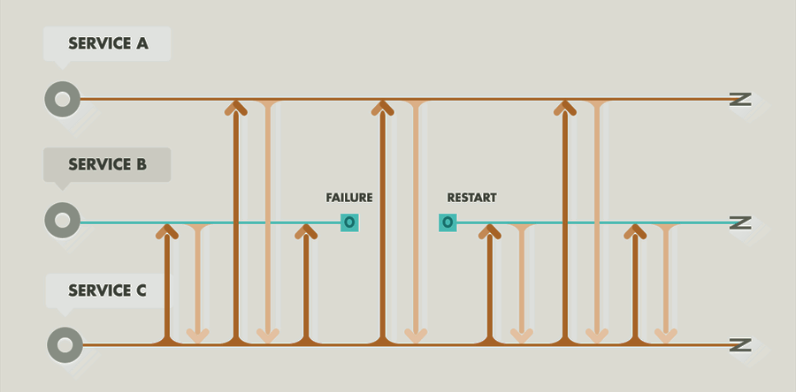

# 


#
\centering
\begin{Huge}
What is Erlang,

and how does it work?
\end{Huge}

# About
\centering
\Large

* Programming Language by Ericsson from 1987
* Functional & Concurrent
* Strong dynamicaly typed
* Influencing
    * From: Prolog
    * To: Clojure, Scala, Elixir
* Running on `BEAM` Virtual Machine
* Using `OTP Framework`
* Named after _Agner Krarup Erlang_
* ... or __Er__icsson __lang__uage


# Erlang Applications

\centering
\Huge

 &nbsp;&nbsp;&nbsp;&nbsp; 


 &nbsp;&nbsp;&nbsp;&nbsp; 

 &nbsp;&nbsp;&nbsp;&nbsp; 

...

# Companies using Erlang

* Facebook _(Chat)_
* WhatsApp _(Chat)_
* Klarna _(Mobile Payment)_
* Basho _(Riak, ...)_
* Amazon _(SimpleDB)_
* Chef _(Server Automation)_
* Plataformatec _(Elixir creator)_
* Kato _(Groupchat)_
* TipBit _(Mailapp)_
* Sqor _(Sport App/News)_
* 2600hz _(VoIP Platform)_
* __Adds__: AddRoll, OpenX, ...
* __Browsergames__: BigPoint, Spilgames, MachineZone, ...
* ...
    


# Comparing Runtimes

\centering
\large

| Erlang 	| Java 	| NodeJS 	| PHP 	|
|-----------------	|-----------------	|----------------	|----------------	|
| VM _(BEAM)_   | VM | VM _(V8)_    | Interpreter |
| compiled 	| compiled 	| interpreted 	| interpreted 	|
| multithreaded 	| multithreaded 	| singlethreaded 	| singlethreaded 	|
| parallel, async 	| parallel, async 	| async 	| sequential 	|
| messagepassing 	| method calls 	| eventloop 	| method calls 	|

# 
\centering

\begin{Huge}
Comparing Handling \\ of HTTP Requests
\end{Huge}


# PHP: HTTP Request

\centering


# NodeJS: HTTP Request

\centering

```javascript
var http = require("http");

var handler = function(request, response) {
  response.writeHead(200, {
    "Content-Type": "text/plain"
  });
  response.write("Hello World!");
  response.end();
};

var server = http.createServer(handler);
 
server.listen(80);
```

# Java: HTTP Request

\centering


# Erlang: HTTP Request

\centering


# 
\centering

\begin{Huge}
Erlang Runtime: BEAM VM
\end{Huge}

# BEAM Virtual Machine

\centering
\Large

* Compareable to Java VM
* But can create _way more_ Processes
* Processes scheduled inside BEAM, not OS
* Processes send and receive Messages
* Processes can have State and Name for PID


# Features of BEAM VM

\centering
\huge

* Microprocesses
* Pattern Matching _(Not Regex)_
* Immutable Variables


# Garbage Collection


# 
\centering

\begin{Huge}
Thinking in Processes
\end{Huge}


# Let it crash



---------------------------------

# Supervisors

* Supervisors can restart crashed processes
* Less defense code
* Any error in code will crash process
    * Shorter cleaner code
    * Faster implementation
    * Robust code handling __all__ errors


# Elevator example

\centering
\Large

* 3 Elevators
* 10 Floors

How many Processes?

# Process State and Messages
\centering
\Large

* Each Process has its own state
* Data exchange via Messages
* Messages handled like Transactions
* Removing Deadlocks and Race Conditions

# 
\centering

\begin{Huge}
Thinking Functional
\end{Huge}


# Functional Erlang
\centering
\Large

* Not _fully_ functional
    * No complex Type System
    * Not free of Side Effects
    * No currying
    * No other "pure" FP
* Immutable Variables
* Small Functions
* Pattern Matching

<!--
# Not free of Side Effects
\centering
\Large

* Messages between Processes
* Global Registry
* Database
* External Services
-->

# Alan Kay about OOP

\centering
\LARGE

> "OOP to me means only messaging, local retention and protection and hiding of state-process, and extreme late-binding of all things."

> [_Dr. Alan Kay_](http://userpage.fu-berlin.de/~ram/pub/pub_jf47ht81Ht/doc_kay_oop_en)


# 
\centering

\begin{Huge}
Coding Erlang
\end{Huge}

# Coding
\Large

* Variables start with capitals
* Atoms start with lowercase
* No type declarations
* Short functions
* Pattern matched function heads
* Multiple function bodies
* Commas, semicolons, dots, arrows
* Small, stable (,easy) declarative Syntax

# Hello World!
\centering

```erlang
io:format("Hello World!").
```

# Fibonacci
\centering

```erlang
fib(0) -> 0;
fib(1) -> 1;
fib(N) when N > 1 -> fib(N-1) + fib(N-2).
```

# Pattern Matching

\centering

```erlang
% Matching on lists
[First, Second, Third] = [1,2,3].

% Matching deep structures
{ok, {SomeName, [FirstValue | MoreValues]}} = a().
```

# Immutable Variables

\centering

```erlang
A = 42.
A = A + 8. % will crash
```

```erlang
B = 42.
A = B + 8.
```


# Hello World Module
\centering

```erlang
-module(hello).
-export([start/0]).

start() ->
    io:format("Hello World!").
```

```shell
$ erlc hello.erl
$ erl -s hello
```

# Hello World Process
\centering

```erlang
-module(hello).
-export([start/0, loop/0]).

start() ->
    Pid = spawn(hello, loop, []),
    Pid ! hello.

loop() ->
    receive
        hello ->
            io:format("Hello World!")
    end,
    loop().
```
---------------------------------------------------

\scriptsize

```erlang
-module(hello_process).
-export([start/0, loop/0]).

start() ->
    Pid = spawn(?MODULE, loop, []),
    register(hello, Pid),
    timer:sleep(1000), whereis(hello) ! hello,
    timer:sleep(1000), whereis(hello) ! {hello, "Julius"},
    timer:sleep(1000), whereis(hello) ! ["Foo", bar].

loop() ->
    receive
        hello ->
			hello();
		{hello, Name} ->
			hello(Name);
        Message ->
			io:format("Unknown message: ~p\n", [Message])
    end,
    loop().

hello() ->
	hello("World").

hello(Name) ->
	io:format("Hello ~s!\n", [Name]).
```

# 
\centering

\begin{Huge}
OTP
\end{Huge}

\begin{large}
the standard library of erlang
\end{large}


# OTP
\centering
\Large

* Supervisors
* Behaviours
    * gen_server
    * gen_fsm
    * gen_event
* Applications


# Learning Erlang

\centering

* [erlang.org](erlang.org) and [erlangcentral.org](erlangcentral.org)
* Books
    * _Learn You Some Erlang_
    * _Programming Erlang_
    * _Erlang and OTP in Action_
    * ...
* IRC Freenode #erlang
* Erlang Mailing List
* Erlang Factory & Conferences


# Erlang the Movie


# 
\centering

\begin{Huge}
Thanks!
\end{Huge}

